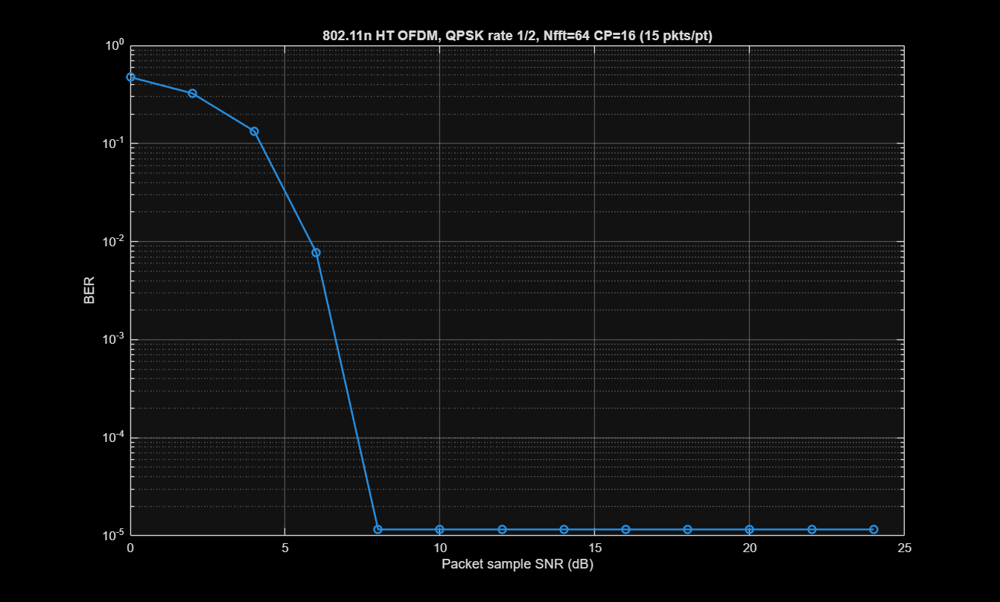
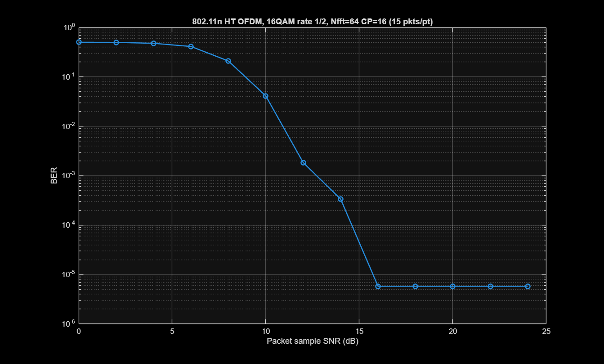
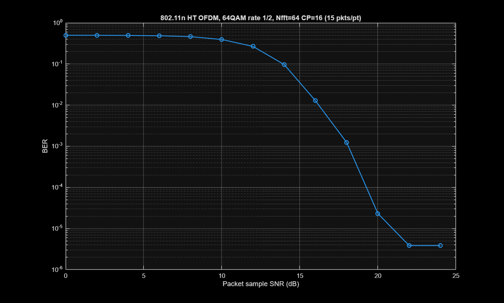

# 📡 Base-MATLAB OFDM Transceiver with FEC

A complete, first-principles implementation of an Orthogonal Frequency-Division Multiplexing (OFDM) transceiver. 

This script models a full physical layer (PHY) communication link in pure MATLAB. **It does not require the Communications Toolbox or any other external add-ons.** 

---

## 🛠️ System Architecture

The simulation models a complete transmit (TX) and receive (RX) chain over an Additive White Gaussian Noise (AWGN) channel. 

### Transmit Chain (TX)
1. **Data Generation:** Generates a randomized payload of raw binary data.
2. **Scrambling:** Whitens the data using a Linear Feedback Shift Register (LFSR) to prevent long sequences of 1s or 0s.
3. **Convolutional Encoding (FEC):** Adds redundancy using a Rate-1/2 convolutional code ($K=3$) to allow the receiver to correct bit errors.
4. **Block Interleaving:** Scatters adjacent bits across the OFDM block to protect against burst errors.
5. **QAM Mapping:** Maps the interleaved bits into complex baseband symbols (QPSK, 16-QAM, or 64-QAM) using Gray coding and unit-power normalization.
6. **Pilot Insertion:** Inserts known BPSK pilot symbols at designated subcarrier indices for channel estimation.
7. **OFDM Modulation (IFFT):** Converts the frequency-domain subcarriers into a time-domain OFDM symbol.
8. **Cyclic Prefix (CP):** Prepends the tail of the OFDM symbol to the front to eliminate Inter-Symbol Interference (ISI).

### Receive Chain (RX)
1. **CP Removal & FFT:** Discards the cyclic prefix and converts the time-domain signal back to the frequency domain.
2. **Channel Estimation & Equalization:** Extracts the pilot subcarriers, estimates the channel phase/amplitude shifts, and applies a Zero-Forcing (ZF) equalizer to the data subcarriers.
3. **QAM Demapping:** Performs minimum-distance hard-decision decoding to convert the complex symbols back into bits.
4. **Deinterleaving:** Reverses the block interleaver to restore the original coded bit sequence.
5. **Viterbi Decoding:** Uses a hard-decision Viterbi algorithm to decode the convolutional code and correct transmission errors.
6. **Descrambling:** Reverses the LFSR modulo-2 addition to recover the original payload.

---

## 🔬 Mathematical & Technical Specifications

### Forward Error Correction (FEC)
* **Type:** Convolutional Encoder
* **Coding Rate:** $r = 1/2$
* **Constraint Length:** $K = 3$
* **Generator Polynomials:** Octal `[7, 5]` (Binary `111` and `101`)

### Scrambler (PN Sequence)
* **Polynomial:** $x^7 + x^4 + 1$

### OFDM Framing
* **FFT Size ($N_{fft}$):** 64 (configurable)
* **Active Subcarriers:** 52 total (48 Data, 4 Pilots)
* **Subcarrier Indexing:** Zero-centered, omitting the DC carrier (`0`). Data bins: `[-26:-1 1:26]`.

### Noise & Channel Modeling
* **Channel:** Additive White Gaussian Noise (AWGN).
* **Power Normalization:** The noise variance is calculated precisely using the $E_b/N_0$ ratio. The script accounts for the coding rate, the cyclic prefix overhead, and the empty FFT bins to ensure the plotted $E_b/N_0$ perfectly aligns with theoretical bounds.

---
📊 Simulation Results

The transceiver's Bit Error Rate (BER) performance is evaluated across different Signal-to-Noise (Eb​/N0​) thresholds. As the modulation order increases, the system transmits more bits per symbol but requires a higher Eb​/N0​ to maintain the same error rate.

Below are the simulation plots for QPSK, 16-QAM, and 64-QAM.
| QPSK Performance | 16-QAM Performance | 64-QAM Performance |
| :---: | :---: | :---: |
|  |  |  |

## 🚀 Usage Guide


### Running the Simulation
At the top of the script, you can configure the system parameters:

```matlab
%% ========================= User parameters ==============================
modType = '16QAM';              % 'QPSK', '16QAM', or '64QAM'
Nfft = 64;                      % FFT/IFFT size (must be even)
cpLen = 16;                     % Cyclic prefix length
numOFDMSymbols = 5000;          % Increase to resolve lower BER floors
EbNoDbVec = 0:1:12;             % Eb/N0 sweep range in dB
