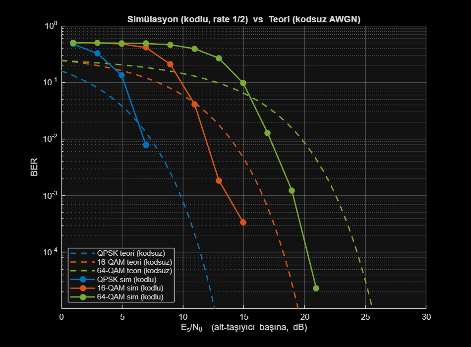

# Base-MATLAB OFDM Transceiver — Simplified IEEE 802.11n HT Packet

A first-principles IEEE 802.11n High Throughput (HT) OFDM link implemented in **pure base MATLAB** — no Communications Toolbox. The convolutional encoder, Viterbi decoder, scrambler, CRC, packet detector and timing recovery are all hand-rolled.

- **`802.11_V4.m`** — current version: BCC + puncturing, hard-decision Viterbi, STF/LTF-based synchronization, CRC-checked HT-SIG decode.
- **`802.11_V3.m`** — previous version: uncoded chain with ideal field extraction (kept for reference).

This README describes **`802.11_V4.m`** and is intended to match the code exactly. Anything that is deliberately reduced relative to the standard is tagged **SIMPLIFIED** or **NOT YET IMPLEMENTED**.

---

## HT Packet Block Order

The transmitted time-domain waveform concatenates four fields in this exact order:

```
[ HT-STF ] → [ HT-LTF ] → [ HT-SIG ] → [ HT-DATA ]
```

For the receiver simulation, silence (noise-only) samples are padded before and after the packet so that packet detection has to actually locate the start.

---

## Block Descriptions: Purpose & Generation

### HT-STF (Short Training Field)
**Purpose:** AGC, packet detection, coarse timing.
**Generation:** a sparse frequency pattern on every 4th subcarrier produces a time waveform that repeats every `Nfft/4 = 16` samples; one short period is normalized to unit power and repeated `numHTSTFRepeats` times. **No CP.**
**SIMPLIFIED:** the frequency-domain sequence is a constant-modulus QPSK-like pattern, not the exact 802.11 HT-STF sequence.

### HT-LTF (Long Training Field)
**Purpose:** channel estimation.
**Generation:** a known BPSK pattern on all 52 used subcarriers → IFFT (common scale) → CP. `numHTLTFSymbols` symbols (default 2) are averaged at the RX for the channel estimate.
**SIMPLIFIED:** single spatial stream only; not the standard HT-LTF mapping matrix.

### HT-SIG (Signal Field)
**Purpose:** carries MCS index and HT-Length so the receiver knows how to decode HT-DATA.
**Generation (now close to the standard structure):**
1. Field bits (MCS = 7 bits, HT-Length in bytes = 16 bits, remainder reserved)
2. **CRC-8** appended
3. **6 tail bits** appended
4. **Rate-1/2 BCC** encoded (same K=7 code as the data field, no puncturing)
5. Block-interleaved, **BPSK**-mapped onto the 48 data subcarriers of **2 OFDM symbols**, with pilots.

The receiver fully decodes HT-SIG (equalize → BPSK demap → deinterleave → Viterbi → **CRC check**) and recovers the MCS and length.
**SIMPLIFIED:** the exact field bit-layout and the CRC-8 polynomial are not bit-exact to the 802.11 HT-SIG definition; HT-SIG is BPSK (not the Q-BPSK / 90°-rotated legacy-compatible mapping).

### HT-DATA (Payload)
**Purpose:** user data.
**TX chain (matches the code):**
```
info bits → scrambler → BCC encoder (K=7) → puncturing
          → block interleaver → QAM map → pilot insertion
          → IFFT → CP
```

---

## Forward Error Correction (BCC + Puncturing)

- **Convolutional code:** constraint length **K = 7**, generator polynomials **g0 = 133₈**, **g1 = 171₈** (the standard 802.11 code). The trellis is terminated with **6 zero tail bits**.
- **Code rates:** `'1/2'`, `'2/3'`, `'3/4'`, selected by `codeRate`.
  - Rate 2/3 puncture pattern: `[1 1 1 0]`
  - Rate 3/4 puncture pattern: `[1 1 1 0 0 1]`
- **Decoder:** a hand-written **64-state hard-decision Viterbi** decoder. Punctured positions are reinserted as **erasures** (zero branch-metric contribution) before decoding.
- The payload length is sized so that, after encoding and puncturing, the coded stream exactly fills the available data subcarriers (any shortfall is zero-padded and stripped at the RX).

**SIMPLIFIED / NOT YET IMPLEMENTED:**
- **Hard-decision** Viterbi only — soft-decision (LLR) decoding is not implemented.
- The **interleaver is a plain row/column block interleaver** per OFDM symbol, *not* the standard two-permutation 802.11 interleaver.
- Rate **5/6** is not implemented.

---

## Synchronization & Channel Estimation

The receiver no longer assumes ideal field extraction. The chain is:

1. **Packet detection — HT-STF autocorrelation.** A delay-correlation metric with lag `Nfft/4` (the STF period) is computed; the first *sustained* run above a threshold marks the rising edge of the STF plateau → coarse start.
2. **Fine timing — HT-LTF matched filter.** The known HT-LTF waveform is correlated over a small search window around the coarse estimate; the correlation peak gives the exact packet start.
3. **Channel estimation — HT-LTF.** A per-subcarrier least-squares estimate `Ĥ_k = Y_k / X_k^{known}` is averaged over the HT-LTF symbols.
4. **Equalization.** HT-SIG and HT-DATA subcarriers are equalized with `Ĥ_k`; residual common-phase error is tracked per OFDM symbol from the pilots.

A constant timing offset within the cyclic prefix is automatically absorbed, because the same offset appears in the LTF estimate and the data and cancels on equalization.

**SIMPLIFIED / NOT YET IMPLEMENTED:**
- **No carrier frequency offset (CFO)** estimation/correction.
- No sample-clock offset, no fractional-delay fine timing.
- Channel estimate is **LS only** (no MMSE, no frequency smoothing).

---

## Power Normalization

All three OFDM fields (HT-LTF, HT-SIG, HT-DATA) share a **single common IFFT scale**, computed once from a representative data symbol so that the average time-domain power is unity. Because each field loads the same 52 unit-power subcarriers, one scale fixes all of them.

This is the key change versus V3 (which normalized every symbol independently): a **common scale means the HT-LTF channel estimate applies directly to HT-SIG and HT-DATA**, which is what makes real (non-ideal) channel estimation work. HT-STF is normalized separately in the time domain (it is not used for equalization).

---

## SNR Definition

SNR is defined per received **complex time-domain sample**, referenced to the **whole transmitted packet**:

$$\text{SNR} = \frac{P_{\text{packet}}}{\sigma^2}, \qquad \sigma^2 = \frac{P_{\text{packet}}}{10^{\text{SNR}_{\text{dB}}/10}}$$

where `P_packet` is the average power of `[HT-STF | HT-LTF | HT-SIG | HT-DATA]` (all CPs included), and noise is `n ~ CN(0, σ²)`:

```matlab
noise = sqrt(noiseVar/2) * (randn(size(txStream)) + 1j*randn(size(txStream)));
```

> Because CP samples, pilots and preamble consume energy without carrying payload bits, the effective payload Eb/N0 is lower than the plotted sample SNR.

---

## RX Processing Chain (as implemented)

1. HT-STF autocorrelation **packet detection**
2. HT-LTF matched-filter **fine timing**
3. HT-LTF **channel estimation** (LS, averaged)
4. **HT-SIG decode** + CRC check (recovers MCS / length)
5. CP removal & FFT (HT-DATA)
6. Per-subcarrier **equalization** + pilot phase tracking
7. **QAM demap** (hard decision)
8. Block **deinterleave**
9. **Depuncture** (erasure insertion)
10. **Viterbi decode**
11. **Descramble**
12. **BER** computation (payload bits only)

---

## Parameters

| Parameter | Value / Options |
|---|---|
| Modulation | QPSK / 16-QAM / 64-QAM (Gray-coded) |
| Code rate | 1/2, 2/3, 3/4 (BCC, K=7, g0=133 g1=171) |
| FFT size | 64 |
| CP length | 16 |
| Used / data / pilot subcarriers | 52 / 48 / 4 (`[-26:-1, 1:26]`, pilots at ±7, ±21) |
| Scrambler | LFSR, x⁷ + x⁴ + 1 |
| Channel | **AWGN only** (multipath/CFO not yet implemented) |

---

## Validation

The script runs an **infinite-SNR sanity check** before the SNR sweep: it requires 0 bit errors, an HT-SIG CRC pass, and exact packet-start detection. This has been verified for QPSK / 16-QAM / 64-QAM across rates 1/2, 2/3 and 3/4.

---

## Simulation Results

Coded BER vs. packet sample SNR, **Monte-Carlo averaged over 15 packets per point** (rate 1/2, AWGN):

| QPSK | 16-QAM | 64-QAM |
|:---:|:---:|:---:|
|  |  |  |

Higher-order modulation gives more throughput but needs higher SNR for the same BER (error-free around ~7 dB QPSK, ~13 dB 16-QAM, ~19 dB 64-QAM).

### Comparison against theory

`compare_theory.m` overlays the simulated **coded** BER on the textbook **uncoded** AWGN BER curves (axis: `Es/N0` per data subcarrier; the packet sample SNR maps to it via `Es/N0 ≈ packetSNR + 0.95 dB`).



- **Modulation ordering matches theory exactly** (QPSK most robust → 64-QAM least), which validates the chain.
- The coded curves cross the uncoded-theory curves: slightly worse at very low SNR, then a steep waterfall with **~3–4 dB coding gain** past the crossover — the well-known behaviour of hard-decision convolutional coding.
- Sim (coded) and theory (uncoded) are *not* expected to coincide; the gap is exactly the rate-1/2 BCC + Viterbi coding gain.

---

## Usage

Configure the parameters at the top of `802.11_V4.m`:

```matlab
modType   = '16QAM';   % 'QPSK', '16QAM', '64QAM'
codeRate  = '1/2';     % '1/2', '2/3', '3/4'
Nfft      = 64;
cpLen     = 16;
numOFDMSymbols = 100;  % OFDM symbols per packet
numPackets     = 20;   % packets averaged per SNR point
snrDbVec  = 0:2:24;
```

Then run the script in MATLAB — no toolboxes required.

---

## Roadmap (next steps)

- Replace the block interleaver with the standard two-permutation 802.11 interleaver.
- Soft-decision (LLR) Viterbi decoding.
- CFO estimation/correction from HT-STF/HT-LTF.
- Move the channel model beyond AWGN (multipath fading).
